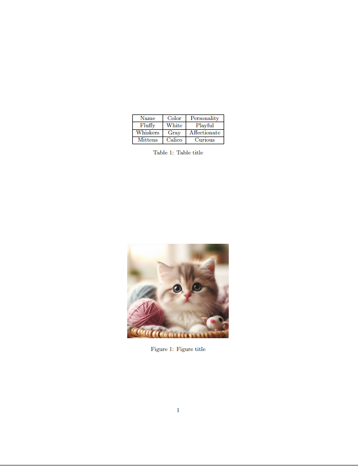

# Реализация генератора LaTeX и конвертера в pdf

## Библиотека для генерации LaTeX-кода таблиц и изображений.

### Описание

**`latex_generator_mr` - библиотека PyPI для генерации LaTeX-кода таблиц и изображений.**

### Инструкция по запуску

**Импорт библиотеки: `from latex_generator_mr import LatexGenerator`**

Класс `LatexGenerator` содержит функции:
1) `generate_latex_table` - генерирует код LaTeX для таблицы из заданного двумерного списка данных.      

    Аргументы:  
    * *data (list of lists):* Входные данные для таблицы. Пример структуры: `[[], [], []]`. Каждый внутренний список представляет собой строку таблицы.
    * *caption (str, optional):* Подпись к таблице.
    * *label (str, optional):* Метка для ссылки на таблицу    

    Функция возвращает:
   * *str:* Код LaTeX для сгенерированной таблицы
  
```
\begin{table}
	\centering
	\begin{tabular}{|c|c|c|} \hline
		& & \\ \hline
		& & \\ \hline
		& & \\ \hline
		& & \\ \hline
	\end{tabular}
	\caption{Table title}
	\label{table label}
\end{table}
```

2) `generate_latex_figure` - функция генерирует код LaTeX для вставки картинки.    
    
    Аргументы:
    * *filename (str):* Имя файла изображения.    
    * *caption (str):* Подпись к изображению.    
    * *label (str):* Метка для ссылки на изображение       

    Функция возвращает:
    * *str:* Код LaTeX для вставки картинки

```
\begin{figure}
	\centering
	\includegraphics[width=0.5\linewidth]{__.jpg}
	\caption{Figure title}
	\label{image label}
\end{figure}
```

## Конвертер LaTeX-кода в pdf

### Описание
Генерация pdf происходит при помощи `pdflatex`.    
В контейнере инициализируется необходимый для работы `pdflatex` дистрибутив `TeX Live` и скрипт конвертации.    
Код LaTeX, сгенерированный с помощью написанной библиотеки `latex_generator_mr`, и полученный на его основе pdf, сохраняются в папку artifacts.




### Инструкция по запуску
1. У вас должен быть установлен `docker`
1. Склонируйте репозиторий `git clone https://github.com/Mikhail-Repkin/advanced_python_ITMO.git`
2. Перейдем в папку `cd advanced_python_ITMO/HW_2`
3. В папке `data` должны находиться данные:    
    * таблица с вашими данными в формате `xlsx`
    * изображение

4. В файле `.env` указываются переменные передаваемые в генератор:
    * Путь к файлу Excel: *TAB*
    * Заголовок таблицы: *CAP_TAB*
    * Метка ссылки таблицы: *LAB_TAB*
    * Название изображения: *IMG*
    * Заголовок изображения: *CAP_IMG* 
    * Метка ссылки изображения: *LAB_IMG*
5. Собираем образ: `docker-compose build`
6. Генерируем код LaTeX и pdf: `docker-compose up`

# Структура проекта
```shell
HW_2
│   .dockerignore                               # Исключения из контекста сборки образа Docker
│   .env                                        # Переменные окружения
│   create_pdf.py                               # Скрипт герации кода LaTeX и создания pdf
│   docker-compose.yml                          # Docker Compose
│   Dockerfile                                  # Файл для создания Docker-образа
│   requirements.txt                            # Файл зависимостей Python
│   README.md                                   # Документация проекта
├───artifacts                                   # Папка с артефактами
├───data                                   	    # Папка с данными для генератора
└───PyPI_Project                                # Исходники библиотеки latex_generator_mr
```

# Технологии

* Бэкенд: `python`
* Линтеры: `black`, `flake8`
* Зависимости: `poetry`
* Контейнеризация: `docker`