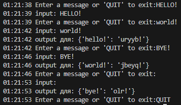

# Концепции многозадачности

## Сравнение синхронного запуска, потоков и процессов

### Описание

**`fib.py` сравнивает время исполнения кода для подсчета чисел Фибоначчи при вызове функции при синхронном запуске, использовании потоков (threading) и процессов (multiprocessing).**

### Инструкция по запуску

1. Склонируйте репозиторий `git clone https://github.com/Mikhail-Repkin/advanced_python_ITMO.git`
2. Перейдем в папку `cd advanced_python_ITMO/HW_4`
3. Создаем виртуальное окружение и устанавливаем зависимости:  
   * `poetry install`    
     *или*
   * `python -m venv venv` --> `venv\Scripts\activate` --> `pip install -r requirements.txt`
4. Для запуска скрипта выполните следующую команду: `poetry run fib.py` или `python fib.py`

### Выводы
При синхронном запуске мы получаем базовое значение времени, когда вызовы функции выполняются последовательно без использования дополнительных потоков или процессов.        
Однако, время выполнения при использовании потоков либо остается примерно таким же, либо немного увеличивается по сравнению с синхронным запуском. Это связано с накладными расходами на создание и управление потоками, а также с тем, что GIL (Global Interpreter Lock) в Python ограничивает параллельное выполнение потоков.    
При использовании процессов время выполнения существенно уменьшается. Это связано с тем, что каждый процесс имеет собственный интерпретатор Python и отдельный GIL, что позволяет достичь более эффективного параллелизма.

```
Method		Time
Sync		19.9335
Threads		19.8377
Processes	3.1987
```

## Практика работы с модулем concurrent.futures

### Описание
**`integrate.py` сравнивает время выполнения функции интегрирования при разном числе jobs и при использовании разных пулов потоков (ThreadPoolExecutor и ProcessPoolExecutor).**

### Инструкция по запуску
1. Выполняем шаги 1-3 из инструкции в задаче 1, для клонирования репозитория, создания виртуального окружения и установки зависимостей, или переходим к пунту 2.
2. Для запуска скрипта выполните следующую команду: `poetry run integrate.py` или `python integrate.py`

### Выводы
При увеличении количества потоков (n_jobs) с использованием ThreadPoolExecutor время выполнения интегрирования ожидаемо не приводит к существенному ускорению по причинам, описанным в задаче 1.    
В отличие от первого пула потоков, ProcessPoolExecutor использует отдельные процессы, что позволяет обойти ограничения GIL и эффективно использовать несколько ядер процессора. При увеличении количества процессов (n_jobs) на этом экзекьюторе время выполнения интегрирования обычно резко уменьшается, однако, после определенного момента увеличение количества jobs уже не приносит существенного ускорения и даже увеличивает время выполнения. Это связано с ограничениями ресурсов процессора (количества доступных ядер) и с накладными расходами на создание и управление дополнительными процессами.

```
ThreadPoolExecutor, jobs: 1, время выполнения: 1.6055s
ThreadPoolExecutor, jobs: 2, время выполнения: 1.6035s
ThreadPoolExecutor, jobs: 3, время выполнения: 1.5880s
ThreadPoolExecutor, jobs: 4, время выполнения: 1.5780s
ThreadPoolExecutor, jobs: 5, время выполнения: 1.5940s
...
ThreadPoolExecutor, jobs: 24, время выполнения: 1.5885s

ProcessPoolExecutor, jobs: 1, время выполнения: 1.6454s
ProcessPoolExecutor, jobs: 2, время выполнения: 0.8750s
ProcessPoolExecutor, jobs: 3, время выполнения: 0.6540s
ProcessPoolExecutor, jobs: 4, время выполнения: 0.5270s
ProcessPoolExecutor, jobs: 5, время выполнения: 0.4615s
ProcessPoolExecutor, jobs: 6, время выполнения: 0.4450s
ProcessPoolExecutor, jobs: 7, время выполнения: 0.4320s
...
ProcessPoolExecutor, jobs: 21, время выполнения: 0.6030s
ProcessPoolExecutor, jobs: 22, время выполнения: 0.5790s
ProcessPoolExecutor, jobs: 23, время выполнения: 0.6100s
ProcessPoolExecutor, jobs: 24, время выполнения: 0.6280s
```

## Практика работы с процессами через модуль multiprocessing

### Описание
**`pipe.py` реализует следующую схему приложения: есть главный процесс и 2 дочерних (A и B). Из главного процесса через stdin отправляются сообщения (строки) в процесс A и помещаются в очередь. К каждому из сообщений процесс A применяет .lower() и отправляет их в процесс B (одно сообщение раз в 5 секунд). Процесс B отправляет закодированную строку через rot13 в главный процесс откуда она печатается в stdout.**

### Инструкция по запуску
1. Выполняем шаги 1-3 из инструкции в задаче 1, для клонирования репозитория, создания виртуального окружения и установки зависимостей, или переходим к пунту 2.
2. Для запуска скрипта выполните следующую команду: `poetry run pipe.py` или `python pipe.py`

### Выводы
Программа демонстрирует работу с многопроцессорностью в Python, используя модуль multiprocessing. Использование очередей (Queue) является эффективным средством для обмена данными между процессами.



# Структура проекта
```shell
HW_4
│   poetry.lock                                 # Lock-файл для Poetry
│   pyproject.toml                              # Файл конфигурации Poetry
│   README.md                                   # Документация проекта
│   fib.py                                      # Сравнение синхронного запуска, потоков и процессов
│   integrate.py                                # Практика с модулем concurrent.futures
│   pipe.py                                     # Практика работы с процессами через модуль multiprocessing
└───artifacts                                   # Папка с артефактами
   ...
```

# Технологии
* Бэкенд: `python`
* Линтеры: `black`, `flake8`
* Зависимости: `poetry`